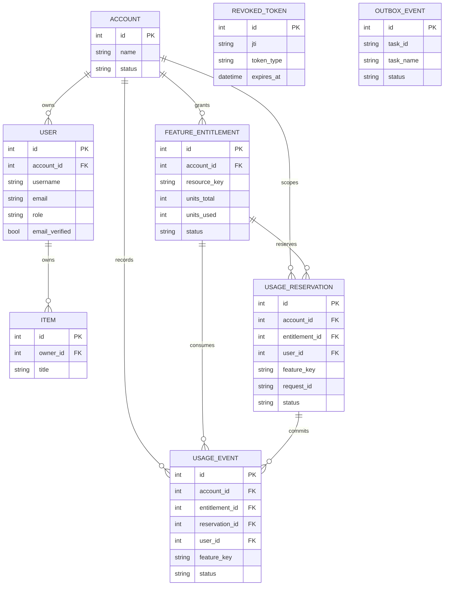
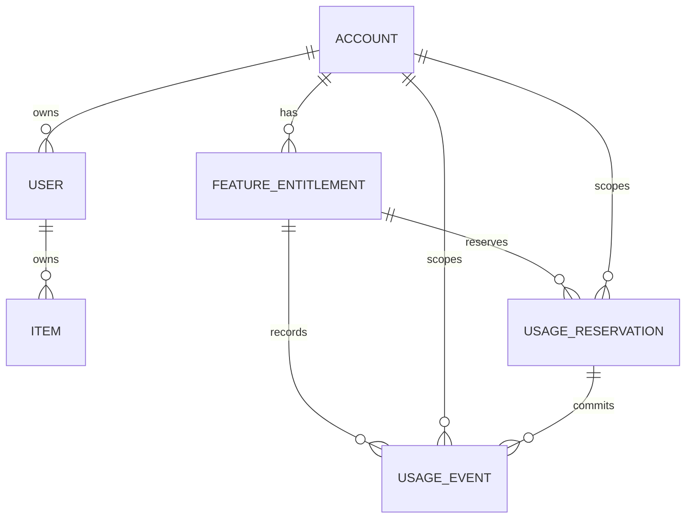
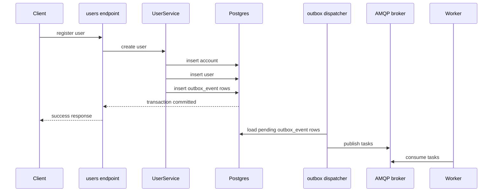
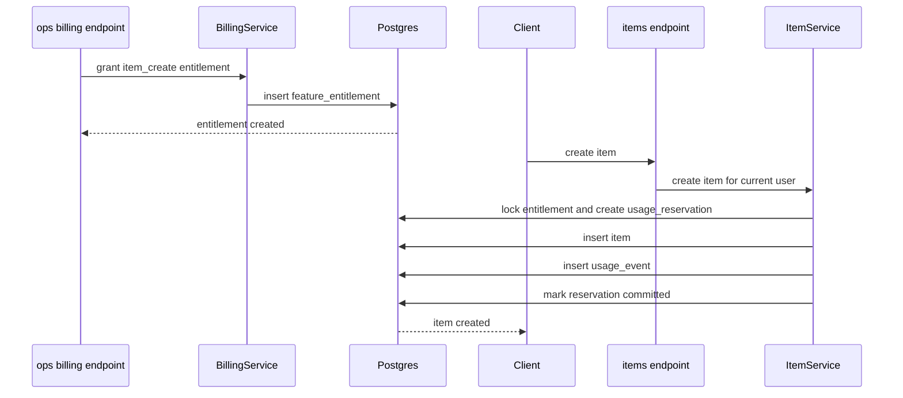

# ภาพรวม Database Schema

ไฟล์นี้สรุปภาพรวม schema ของ database ใน template นี้แบบอ่านง่ายและเชื่อมกับ domain ของระบบ

ควรใช้คู่กับ:

- [`architecture.md`](./architecture.md) ถ้าจะเข้าใจ boundaries ของระบบ
- [`database-migrations.md`](./database-migrations.md) ถ้าจะเปลี่ยน schema
- [`alembic/versions/20260402_0001_initial_schema.py`](../alembic/versions/20260402_0001_initial_schema.py) ถ้าจะดู source of truth ฝั่ง migration

มอง schema ชุดนี้ให้ง่ายที่สุด มันแบ่งได้เป็น 4 กลุ่ม:

- core auth และ identity
- example product data
- billing / entitlement
- async outbox delivery

## ERD แบบดูภาพเดียว

ถ้าอยากเห็นภาพรวมทั้ง schema แบบเร็วที่สุด ให้เริ่มจากรูปนี้ก่อน:

หมายเหตุ:

- `revoked_token` กับ `outbox_event` ถูกแยกออกจาก ownership graph หลักโดยตั้งใจ
- `outbox_event` อยู่ใน domain ของ async delivery ไม่ใช่ความเป็นเจ้าของทางธุรกิจโดยตรง
- `item` เป็น sample business table ที่ใช้สาธิต entitlement enforcement ในระบบนี้

## ความสัมพันธ์ระดับสูง

รูปนี้เป็นภาพ simplified เพื่อให้เข้าใจเร็ว ส่วนรายละเอียดจริงของ column และ constraints ให้อิง model กับ migration เป็นหลัก

## Core Auth และ Identity

### `account`

model:

- [`app/db/models/account.py`](../app/db/models/account.py)

หน้าที่:

- เป็นเจ้าของเชิง logical ของ entitlements และ usage
- เป็น parent ของ users หลายคนได้

field สำคัญ:

- `id`
- `name`
- `status`
- `created_at`
- `updated_at`

### `user`

model:

- [`app/db/models/user.py`](../app/db/models/user.py)

หน้าที่:

- เก็บ identity ของผู้ใช้
- เก็บ state ที่เกี่ยวกับ auth
- เก็บ role สำหรับ authorization ขั้นต้น

field สำคัญ:

- `id`
- `account_id`
- `username`
- `email`
- `hashed_password`
- `is_active`
- `email_verified`
- `role`
- `failed_login_attempts`
- `locked_until`

relationship สำคัญ:

- user หนึ่งคนอยู่ใน `account` หนึ่งตัว
- user หนึ่งคนมี `item` ได้หลายรายการ

### `revoked_token`

model:

- [`app/db/models/revoked_token.py`](../app/db/models/revoked_token.py)

หน้าที่:

- เก็บ refresh token ที่ถูก revoke ไปแล้ว
- ใช้กับ refresh rotation และ logout flow

field สำคัญ:

- `jti`
- `token_type`
- `revoked_at`
- `expires_at`

## Example Product Data

### `item`

model:

- [`app/db/models/item.py`](../app/db/models/item.py)

หน้าที่:

- table ตัวอย่างของ sample `items` module
- เป็น feature ตัวอย่างที่ถูกใช้สาธิต entitlement enforcement จริง

field สำคัญ:

- `id`
- `title`
- `description`
- `owner_id`
- `created_at`

relationship สำคัญ:

- item หนึ่งรายการเป็นของ user หนึ่งคน

policy ตัวอย่างปัจจุบัน:

- `POST /api/v1/items/` สำเร็จ 1 ครั้ง จะ consume `item_create` 1 unit

## Billing และ Entitlements

### `feature_entitlement`

model:

- [`app/db/models/feature_entitlement.py`](../app/db/models/feature_entitlement.py)

หน้าที่:

- grant สิทธิ์ให้ account ใช้ resource บางอย่างได้
- track จำนวนทั้งหมดและจำนวนที่ใช้ไปแล้ว

field สำคัญ:

- `account_id`
- `resource_key`
- `units_total`
- `units_used`
- `status`
- `valid_from`
- `valid_until`
- `source_type`
- `source_id`

### `usage_reservation`

model:

- [`app/db/models/usage_reservation.py`](../app/db/models/usage_reservation.py)

หน้าที่:

- จองสิทธิ์ชั่วคราวก่อน commit usage จริง
- ช่วยกัน race condition ตอนมีหลาย request มากิน quota พร้อมกัน

field สำคัญ:

- `account_id`
- `entitlement_id`
- `user_id`
- `resource_key`
- `feature_key`
- `units_reserved`
- `request_id`
- `status`
- `expires_at`

lifecycle:

- เริ่มจาก `active`
- แล้วค่อยกลายเป็น `committed`, `released`, หรือ `expired`

### `usage_event`

model:

- [`app/db/models/usage_event.py`](../app/db/models/usage_event.py)

หน้าที่:

- ledger การใช้งานแบบ durable
- เป็นฐานของ usage history และ usage report

field สำคัญ:

- `account_id`
- `entitlement_id`
- `reservation_id`
- `user_id`
- `resource_key`
- `feature_key`
- `units`
- `request_id`
- `status`
- `created_at`

status ที่พบบ่อย:

- `committed`
- `reversed`

## Async และ Outbox Delivery

### `outbox_event`

model:

- [`app/db/models/outbox_event.py`](../app/db/models/outbox_event.py)

หน้าที่:

- เก็บ async tasks ไว้ใน DB ก่อน publish เข้า broker
- รองรับ transactional outbox pattern

field สำคัญ:

- `task_id`
- `task_name`
- `payload`
- `source`
- `status`
- `attempts`
- `available_at`
- `published_at`
- `last_error`

## สรุปแบบสั้นที่สุด

ถ้าจะจำ schema นี้แบบเร็ว:

- `account` กับ `user` คือ identity และ ownership
- `item` คือ sample business table
- `feature_entitlement`, `usage_reservation`, `usage_event` คือแกน quota/billing
- `revoked_token` คือ token lifecycle
- `outbox_event` คือ reliable async publishing

## Database Walkthroughs

schema จะเข้าใจง่ายขึ้นมากถ้าดูผ่าน flow จริงของระบบ

### จากการสมัคร user ไปจนถึง outbox delivery

นี่คือ flow ระดับสูงของการสมัคร user ใหม่ใน template ปัจจุบัน:

tables ที่เกี่ยวข้อง:

- `account`
- `user`
- `outbox_event`

ทำไม flow นี้สำคัญ:

- user data กับ async tasks ถูก commit พร้อมกัน
- การ publish เข้า broker ถูกแยกออกจาก request transaction
- ถ้า worker มีปัญหา ก็ไม่ทำให้ DB write ต้นทางเสียตามไปด้วย

### จากการ grant entitlement ไปจนถึงการสร้าง item

นี่คือ quota flow ตัวอย่างที่ `items` module ใช้อยู่ตอนนี้:

tables ที่เกี่ยวข้อง:

- `account`
- `user`
- `feature_entitlement`
- `usage_reservation`
- `usage_event`
- `item`

ทำไม flow นี้สำคัญ:

- quota ถูกถือโดย account ไม่ใช่แค่ user คนเดียว
- reservation ช่วยกัน concurrent consumption
- usage history ยัง audit ได้แม้สร้าง business row สำเร็จไปแล้ว

## Source Of Truth

ถ้าจะอ่านภาพรวม ใช้ docs กับ models ได้

แต่ถ้าจะอิง schema rollout จริง ให้ยึดสองอย่างนี้เป็นหลัก:

- [`app/db/models`](../app/db/models)
- [`alembic/versions`](../alembic/versions)

ถ้า docs กับ migration ไม่ตรงกัน ให้เชื่อ migration ก่อน แล้วค่อยอัปเดต docs ตาม
