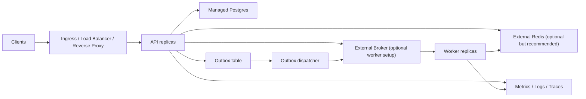

# Production Topology

ไฟล์นี้สรุป topology ที่แนะนำถ้าจะใช้ template นี้ใน production-like หรือ production environment จริง

ควรอ่านคู่กับ:

- [deployment.md](/Users/pluto/Documents/git/fastapi101/docs-thai/deployment.md)
- [secret-management.md](/Users/pluto/Documents/git/fastapi101/docs-thai/secret-management.md)
- [observability.md](/Users/pluto/Documents/git/fastapi101/docs-thai/observability.md)
- [first-deploy-checklist.md](/Users/pluto/Documents/git/fastapi101/docs-thai/first-deploy-checklist.md)

## baseline topology ที่แนะนำ

## คำแนะนำราย component

### API

แนะนำให้:

- เป็น stateless replicas
- มี readiness และ liveness probes
- ไม่พึ่ง local disk สำหรับ app state

### Postgres

แนะนำให้:

- ใช้ managed Postgres หรือ cluster ที่ดูแลแยกจาก app
- มี automated backups
- มี point-in-time recovery ถ้า platform รองรับ
- sizing connection pool โดยคิดรวม API, worker, และ jobs

### Redis

ควรใช้เมื่อ:

- API หลาย replica ต้องแชร์ auth rate limiting state
- worker หลาย replica ต้องแชร์ idempotency state
- cache ควรแชร์ข้าม process หรือ survive การ restart

baseline role split ที่แนะนำ:

- `/0` auth rate limiting และ Redis health check
- `/1` worker idempotency
- `/2` application cache

### Broker

ถ้าเปิด worker flow ให้ใช้ durable broker ที่แยกจาก app

แนะนำให้:

- broker อยู่คนละ lifecycle กับ API
- มี durable queues
- มี retry และ dead-letter queues
- มี monitoring สำหรับ queue depth และ connection failures

## รูปแบบ deployment ตามระดับความโต

### small internal service

รับได้:

- API 1-2 replicas
- managed Postgres
- Redis ภายนอก optional
- worker optional

### standard multi-instance service

แนะนำ:

- API 2+ replicas
- managed Postgres
- external Redis
- worker และ dispatcher แยกจาก API
- internal metrics scrape

### async-heavy service

แนะนำ:

- scale API, worker, และ dispatcher แยกกัน
- ใช้ external broker
- ใช้ external Redis
- มี DLQ monitoring และ replay runbook
- มี outbox monitoring

## อะไรที่ไม่ควรผูก lifecycle ไว้ด้วยกัน

อย่ามองสิ่งเหล่านี้เป็น runtime ตัวเดียวกันใน production:

- API กับ Postgres
- API กับ Redis
- API กับ broker
- API กับ background jobs

เพราะจะทำให้:

- deploy เสี่ยงขึ้น
- scale ยากขึ้น
- failure isolation แย่ลง

## defaults ที่ควร prefer

- Postgres อยู่นอก app deployment boundary
- Redis อยู่นอก app deployment boundary
- worker idempotency ใช้ Redis เมื่อมีหลาย worker
- auth rate limiting ใช้ Redis เมื่อมีหลาย API instances
- metrics scrape ผ่าน internal network
- ใช้ image เดียว แต่แยก command สำหรับ API, worker, dispatcher, และ jobs
