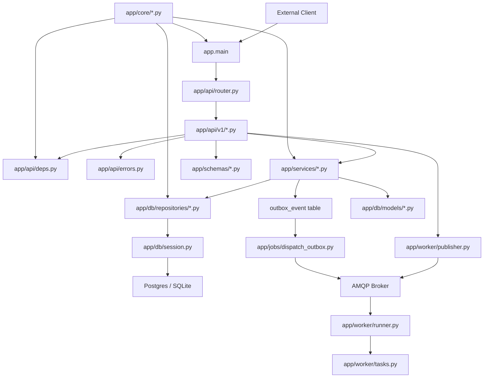
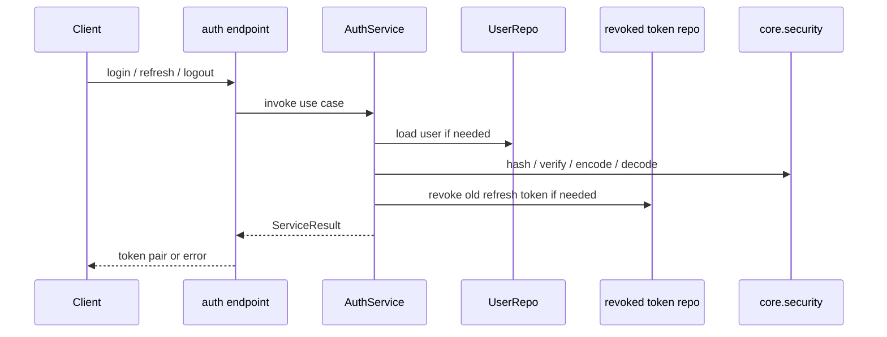
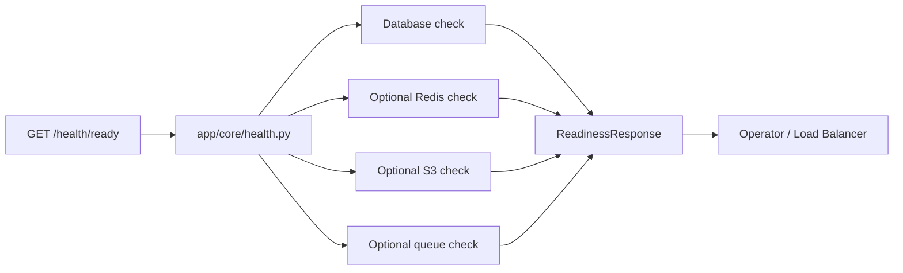
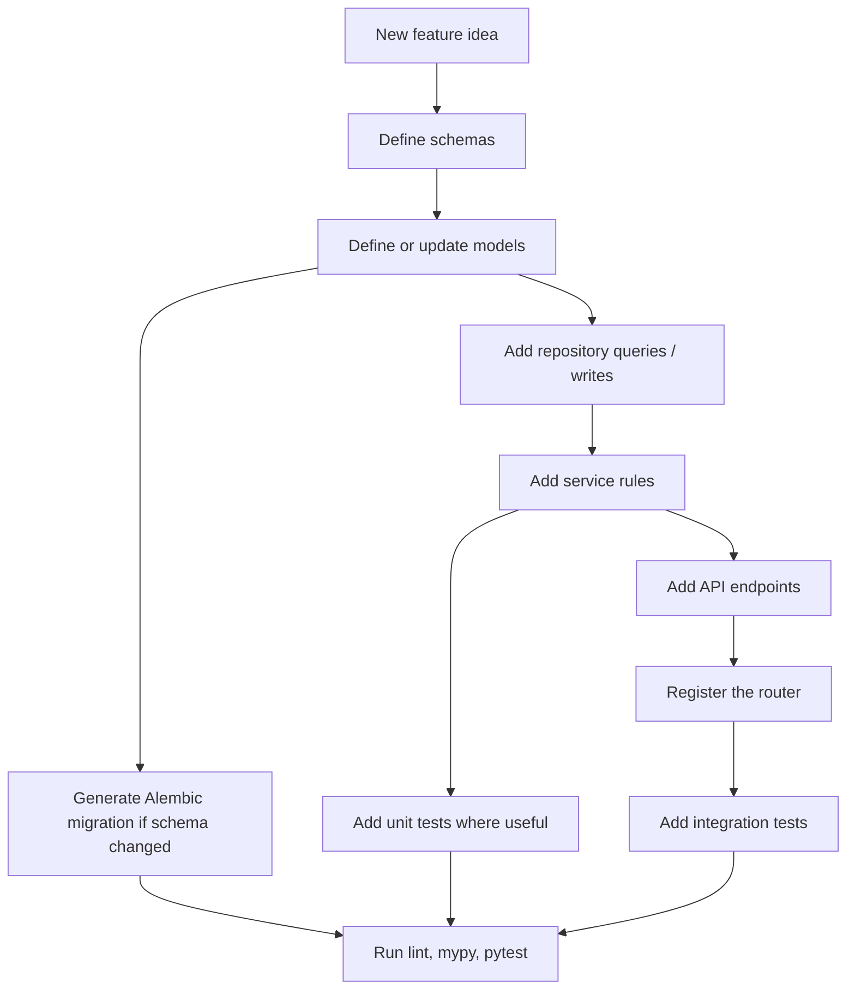

# Architecture Guide

This document explains how the template is organized, why the layers exist, and how data moves through the system.

It is intentionally more detailed than the root [README.md](/Users/pluto/Documents/git/fastapi101/README.md). The README is meant for quick onboarding. This file is meant for developers who want to understand the template deeply before extending it.

## Design Goals

This template is built around a few practical goals:

- keep HTTP concerns out of business logic
- keep persistence concerns out of routes
- make database schema changes explicit and repeatable
- make auth, logging, health, and telemetry available from day one
- keep tests aligned with the actual architecture

The result is a codebase that is easy to grow without collapsing into route-heavy CRUD files.

## Layered Model

The application is organized into distinct layers with clear responsibilities.

Each layer should depend "downward" toward more concrete implementation details, not sideways into unrelated concerns.

## Main Application Wiring

[app/main.py](/Users/pluto/Documents/git/fastapi101/app/main.py) is the assembly point of the application.

It is responsible for:

- creating the FastAPI app
- loading middleware
- connecting telemetry
- registering routers
- defining health endpoints
- centralizing exception handling

This file should remain mostly declarative. If business rules start appearing here, the architecture is drifting.

## API Layer

The API layer lives in [app/api](/Users/pluto/Documents/git/fastapi101/app/api) and [app/api/v1](/Users/pluto/Documents/git/fastapi101/app/api/v1).

Its job is to translate HTTP into application calls:

- parse request payloads
- inject dependencies
- call services
- map service failures into HTTP errors
- return response schemas

### Routers

[app/api/router.py](/Users/pluto/Documents/git/fastapi101/app/api/router.py) mounts versioned routers.

[app/api/v1/router.py](/Users/pluto/Documents/git/fastapi101/app/api/v1/router.py) registers concrete endpoint groups like:

- auth
- users
- items

The `items` module is optional and acts as a sample feature slice.

### Dependencies

[app/api/deps.py](/Users/pluto/Documents/git/fastapi101/app/api/deps.py) contains shared dependency logic such as:

- loading a request-scoped DB session
- extracting and validating the current user from the access token

This keeps auth/session code out of each individual endpoint.

### API Error Mapping

[app/api/errors.py](/Users/pluto/Documents/git/fastapi101/app/api/errors.py) is the bridge between service-level failures and HTTP responses.

The API layer is where HTTP status codes belong. Services should describe failure in domain terms, not transport terms.

## Services Layer

The service layer lives in [app/services](/Users/pluto/Documents/git/fastapi101/app/services).

This is where business logic lives.

Examples:

- [app/services/auth_service.py](/Users/pluto/Documents/git/fastapi101/app/services/auth_service.py)
- [app/services/user_service.py](/Users/pluto/Documents/git/fastapi101/app/services/user_service.py)
- [app/services/item_service.py](/Users/pluto/Documents/git/fastapi101/app/services/item_service.py)

Services are responsible for:

- coordinating repositories
- enforcing business rules
- shaping domain outcomes into `ServiceResult`

Services should not:

- return FastAPI responses
- raise `HTTPException`
- know about request/response formatting

## Result Pattern

[app/services/result.py](/Users/pluto/Documents/git/fastapi101/app/services/result.py) defines `ServiceResult`.

This pattern gives a stable interface between the service layer and the API layer.

Success path:

- `result.ok` is true
- `result.value` contains the success payload

Failure path:

- `result.ok` is false
- `result.error.code` identifies the failure category
- `result.error.message` contains a human-readable explanation

This makes services easy to test without spinning up HTTP handlers.

## Repository Layer

The repository layer lives in [app/db/repositories](/Users/pluto/Documents/git/fastapi101/app/db/repositories).

Repositories own persistence behavior:

- queries
- inserts and updates
- commit/refresh lifecycle
- low-level persistence error translation

This gives you a clean place to change persistence behavior later without rewriting route or service code.

The base helper in [app/db/repositories/base.py](/Users/pluto/Documents/git/fastapi101/app/db/repositories/base.py) centralizes common save behavior so feature repositories do not duplicate commit/refresh/rollback logic.

## Models and Schemas

The template separates database models from external API schemas.

### Models

Database models live in [app/db/models](/Users/pluto/Documents/git/fastapi101/app/db/models).

These represent persisted state and relationships:

- [app/db/models/user.py](/Users/pluto/Documents/git/fastapi101/app/db/models/user.py)
- [app/db/models/item.py](/Users/pluto/Documents/git/fastapi101/app/db/models/item.py)
- [app/db/models/revoked_token.py](/Users/pluto/Documents/git/fastapi101/app/db/models/revoked_token.py)

### Schemas

Request/response schemas live in [app/schemas](/Users/pluto/Documents/git/fastapi101/app/schemas).

These define the API contract:

- [app/schemas/user.py](/Users/pluto/Documents/git/fastapi101/app/schemas/user.py)
- [app/schemas/item.py](/Users/pluto/Documents/git/fastapi101/app/schemas/item.py)
- [app/schemas/token.py](/Users/pluto/Documents/git/fastapi101/app/schemas/token.py)
- [app/schemas/common.py](/Users/pluto/Documents/git/fastapi101/app/schemas/common.py)

This separation matters because a database model almost never matches the shape you want to expose externally forever.

## Database Sessions and Migrations

[app/db/session.py](/Users/pluto/Documents/git/fastapi101/app/db/session.py) creates the engine and request-scoped sessions.

[app/db/base.py](/Users/pluto/Documents/git/fastapi101/app/db/base.py) imports model metadata so Alembic can discover the full schema.

For a table-by-table map of the current schema, see [docs/database-schema.md](/Users/pluto/Documents/git/fastapi101/docs/database-schema.md).

For the step-by-step process of changing schema safely, see [docs/database-migrations.md](/Users/pluto/Documents/git/fastapi101/docs/database-migrations.md).

Migrations are managed through:

- [alembic/env.py](/Users/pluto/Documents/git/fastapi101/alembic/env.py)
- [alembic/versions/20260402_0001_initial_schema.py](/Users/pluto/Documents/git/fastapi101/alembic/versions/20260402_0001_initial_schema.py)

Important rule:

- the application should not silently create schema at startup
- Alembic should be the schema source of truth

That keeps local, staging, CI, and production environments aligned.

## Outbox Pattern

This template now uses a transactional outbox pattern for broker publishing.

High-level flow:

1. the request transaction writes domain data and one or more `outbox_event` rows together
2. the request returns successfully once the database transaction commits
3. the outbox dispatcher polls pending rows from `outbox_event`
4. the dispatcher publishes those events to the AMQP broker
5. the background worker consumes the broker messages

This reduces the risk of:

- DB commit succeeds but broker publish fails
- API process crashes after commit but before publish
- request handlers needing broker connectivity to complete domain writes

## Authentication Architecture

Auth is spread across a few focused components:

- [app/core/security.py](/Users/pluto/Documents/git/fastapi101/app/core/security.py): hashing + token creation/decoding
- [app/api/deps.py](/Users/pluto/Documents/git/fastapi101/app/api/deps.py): current-user dependency
- [app/services/auth_service.py](/Users/pluto/Documents/git/fastapi101/app/services/auth_service.py): login, refresh, logout logic
- [app/db/models/revoked_token.py](/Users/pluto/Documents/git/fastapi101/app/db/models/revoked_token.py): revoked refresh token records
- [app/db/repositories/revoked_token.py](/Users/pluto/Documents/git/fastapi101/app/db/repositories/revoked_token.py): revocation persistence

### Auth Request Flow

The key architectural idea is that token lifecycle rules live in the service layer, not in route handlers.

## Logging, Audit, and Telemetry

Observability lives mostly in:

- [app/core/logging.py](/Users/pluto/Documents/git/fastapi101/app/core/logging.py)
- [app/core/request.py](/Users/pluto/Documents/git/fastapi101/app/core/request.py)
- [app/core/telemetry.py](/Users/pluto/Documents/git/fastapi101/app/core/telemetry.py)

The app emits:

- structured JSON logs
- access logs
- exception logs
- audit logs for auth/security events

The middleware in [app/main.py](/Users/pluto/Documents/git/fastapi101/app/main.py) attaches request IDs, duration, and request/response metadata so logs are useful in production.

Telemetry is optional and config-driven. If enabled, the app can attach trace context to logs and export spans through OpenTelemetry.

## Background Worker

Optional background-task support lives in [app/worker](/Users/pluto/Documents/git/fastapi101/app/worker).

The worker layer is split into a few simple pieces:

- [app/worker/publisher.py](/Users/pluto/Documents/git/fastapi101/app/worker/publisher.py): publishes durable task messages to the broker
- [app/worker/runner.py](/Users/pluto/Documents/git/fastapi101/app/worker/runner.py): long-running consumer process
- [app/worker/tasks.py](/Users/pluto/Documents/git/fastapi101/app/worker/tasks.py): task registry and handlers
- [app/worker/schemas.py](/Users/pluto/Documents/git/fastapi101/app/worker/schemas.py): task envelope contract
- [app/worker/idempotency.py](/Users/pluto/Documents/git/fastapi101/app/worker/idempotency.py): duplicate-protection backend for worker task IDs

Current example flow:

1. `POST /api/v1/users/` creates a user
2. the route publishes `user.registered`, `email.send_welcome`, and `webhook.user_registered`
3. the worker consumes tasks from the AMQP queue
4. each task carries a stable `task_id`
5. the worker claims that `task_id` through the idempotency backend before processing
6. failed tasks move through the retry queue with exponential backoff and eventually to the dead-letter queue if retries are exhausted
7. registered task handlers process each task type

This gives the template a baseline pattern for:

- email sending
- webhook delivery
- report generation
- third-party sync jobs

The example email and webhook tasks now call dedicated service functions instead of logging inline, so teams can replace those implementations without changing worker routing.

Routes should publish tasks only after the main request succeeds. Background work should not be required for the main request to be considered successful.

## Health and Readiness

Health logic lives in [app/core/health.py](/Users/pluto/Documents/git/fastapi101/app/core/health.py).

The app exposes:

- `/health`
- `/health/live`
- `/health/ready`

`/health/ready` is the most operationally important endpoint because it reports dependency-level results.

### Readiness Flow

This design makes it easy to add more dependency checks without bloating `main.py`.

## Example Feature Slice

The `items` module demonstrates how a single feature should be wired end to end.

It also serves as the quota reference implementation in this template:

- `POST /api/v1/items/` maps to feature key `items.create`
- `items.create` consumes one `item_create` entitlement unit on success
- the service reserves quota first, stages the item write, and then commits item + usage accounting together

Feature files:

- route: [app/api/v1/items.py](/Users/pluto/Documents/git/fastapi101/app/api/v1/items.py)
- service: [app/services/item_service.py](/Users/pluto/Documents/git/fastapi101/app/services/item_service.py)
- repository: [app/db/repositories/item.py](/Users/pluto/Documents/git/fastapi101/app/db/repositories/item.py)
- model: [app/db/models/item.py](/Users/pluto/Documents/git/fastapi101/app/db/models/item.py)
- schema: [app/schemas/item.py](/Users/pluto/Documents/git/fastapi101/app/schemas/item.py)
- tests: [tests/integration/api/test_items.py](/Users/pluto/Documents/git/fastapi101/tests/integration/api/test_items.py)

If you are starting a real product:

- keep it as a reference
- or disable it with `EXAMPLES__ENABLE_ITEMS_MODULE="false"`
- or remove the full slice once your first real domain module is in place

### New Feature Slice Workflow

When you add a new domain module, add it as a full vertical slice instead of only adding a route or only adding a model.

Typical file touch points:

- `app/schemas/<feature>.py`
- `app/db/models/<feature>.py`
- `app/db/repositories/<feature>.py`
- `app/services/<feature>_service.py`
- `app/api/v1/<feature>.py`
- `app/api/v1/router.py`
- `alembic/versions/<revision>.py`
- `tests/integration/api/test_<feature>.py`
- optionally `tests/unit/...`

The reason for doing this as a slice is simple: it keeps each feature coherent across layers and avoids pushing business logic into routes or persistence details into services.

### Safely Removing The Example Slice

If you want the template to start from a cleaner product-specific baseline, you can remove the `items` slice completely.

Recommended order:

1. Disable the module with `EXAMPLES__ENABLE_ITEMS_MODULE="false"`.
2. Remove the route file.
3. Remove the service file.
4. Remove the repository file.
5. Remove the model file.
6. Remove the schema file.
7. Remove imports and re-exports that still reference the slice.
8. Remove tests for that slice.
9. Regenerate or rewrite the initial migration so the database history matches the remaining schema.
10. Re-run lint, typing, and tests.

Important note:

- do not leave the migration history describing tables that no longer exist in the codebase
- do not leave stale re-exports in package `__init__` files
- do not leave sample tests behind, because they create misleading failures for future contributors

### Starter Checklist For The First Real Module

When turning the template into a real product, the first real domain module is where the architectural habits get set.

Use this checklist:

1. name the module around the real business concept, not around CRUD mechanics
2. define schemas first so the API contract is clear
3. define models only for persisted state, not for response convenience
4. add repository functions that reflect the queries the service actually needs
5. put business rules in the service layer, not in the route
6. expose only the routes you are ready to support
7. add migrations immediately with the schema change
8. add integration tests for the happy path and important failure paths
9. add unit tests for any branching business logic
10. document any new dependency that affects readiness, logging, or deployment

If the first real module follows the architecture cleanly, future modules usually copy the right pattern automatically.

## Testing Strategy

Tests are grouped by architectural purpose.

### Unit Tests

Located in:

- [tests/unit/core](/Users/pluto/Documents/git/fastapi101/tests/unit/core)
- [tests/unit/repositories](/Users/pluto/Documents/git/fastapi101/tests/unit/repositories)

These validate focused logic in isolation.

### Integration Tests

Located in:

- [tests/integration/api](/Users/pluto/Documents/git/fastapi101/tests/integration/api)

These validate the behavior of complete request flows through routes, dependencies, services, and repositories.

### Postgres Integration Tests

Located in:

- [tests/integration/postgres](/Users/pluto/Documents/git/fastapi101/tests/integration/postgres)

These run against a real Postgres database and use transaction-per-test rollback.

## Configuration Model

Settings are grouped logically in [app/core/config.py](/Users/pluto/Documents/git/fastapi101/app/core/config.py):

- `APP__*`
- `EXAMPLES__*`
- `API__*`
- `SECURITY__*`
- `DATABASE__*`
- `LOGGING__*`
- `TELEMETRY__*`
- `HEALTH__*`

This keeps config scalable as the project grows.

Use [/.env.example](/Users/pluto/Documents/git/fastapi101/.env.example) as the starting point for local environments.

## Extension Rules

When adding a new domain module, follow the same full-slice pattern:

1. add schemas
2. add or update models
3. add repository functions
4. add service logic
5. add API routes
6. add tests
7. add migrations if schema changed

This template stays healthy when features are added as coherent slices, not as isolated route files.

## What To Preserve As The Project Grows

- keep routes thin
- keep services free from HTTP concerns
- keep schemas free from DB/session concerns
- keep repositories responsible for persistence behavior
- keep Alembic as the schema source of truth
- keep config centralized
- keep observability concerns in `core`

If you preserve those rules, this template remains understandable even as the product becomes much larger.
