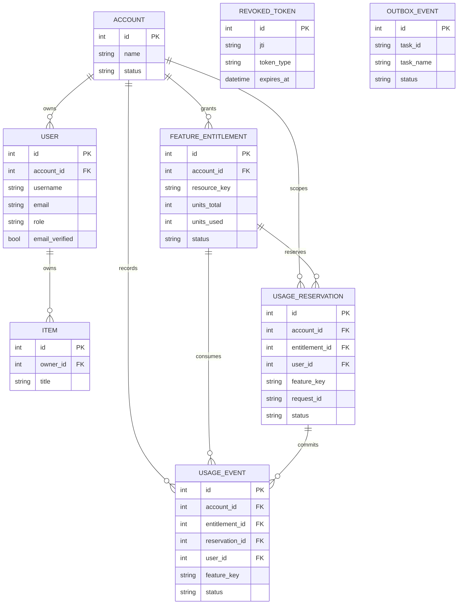
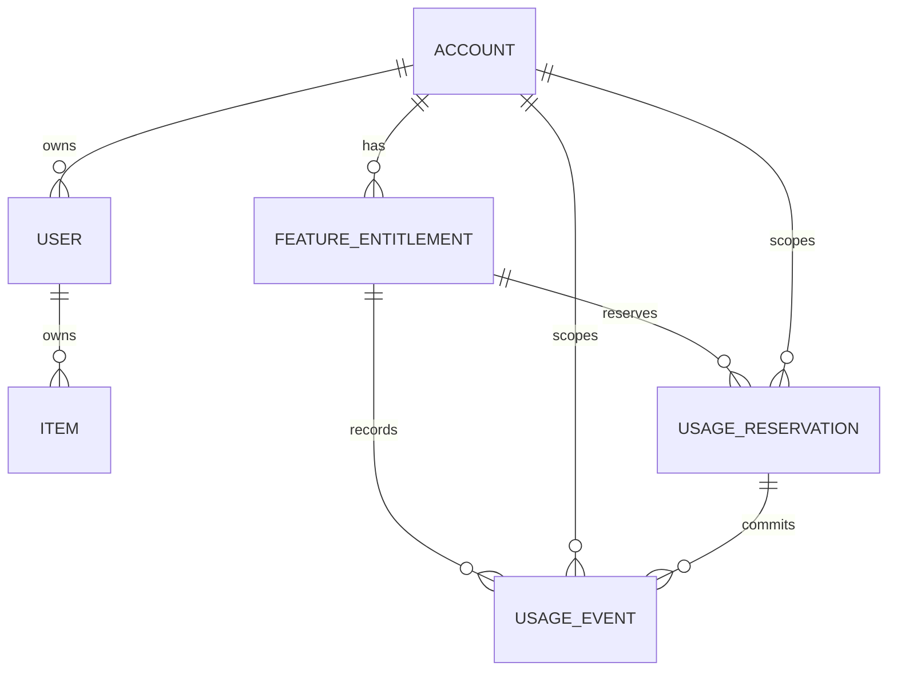
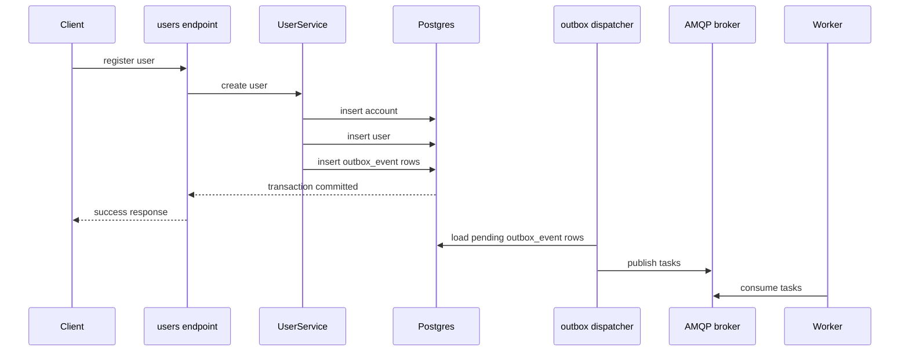
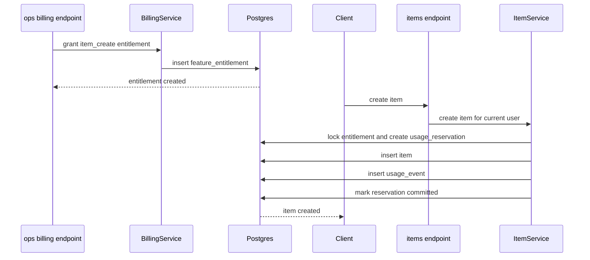

# Database Schema

This document gives a practical map of the current database schema in the template.

Use it together with:

- [`docs/architecture.md`](./architecture.md) for system boundaries
- [`docs/database-migrations.md`](./database-migrations.md) for how schema changes are made
- [`alembic/versions/20260402_0001_initial_schema.py`](../alembic/versions/20260402_0001_initial_schema.py) for the concrete migration source of truth

The schema is easiest to understand as four domains:

- core auth and identity
- example product data
- billing and entitlements
- async outbox delivery

## ERD At A Glance

If you want a one-screen view first, start here:

Notes:

- `revoked_token` and `outbox_event` are intentionally isolated from the core ownership graph
- `outbox_event` participates in async delivery, not direct business ownership
- `item` is the sample business table used to demonstrate entitlement enforcement

## High-Level Relationship Map

This is a simplified view. The exact columns, indexes, and constraints live in the models and migrations.

## Core Auth And Identity

### `account`

Model:

- [`app/db/models/account.py`](../app/db/models/account.py)

Purpose:

- logical owner of entitlements and usage
- parent container for one or more users

Important fields:

- `id`
- `name`
- `status`
- `created_at`
- `updated_at`

### `user`

Model:

- [`app/db/models/user.py`](../app/db/models/user.py)

Purpose:

- application identity and authentication state
- privileged role marker for operations access

Important fields:

- `id`
- `account_id`
- `username`
- `email`
- `hashed_password`
- `is_active`
- `email_verified`
- `role`
- `failed_login_attempts`
- `locked_until`

Important relationships:

- belongs to one `account`
- owns many `item` rows

### `revoked_token`

Model:

- [`app/db/models/revoked_token.py`](../app/db/models/revoked_token.py)

Purpose:

- stores revoked refresh tokens so refresh rotation and logout can invalidate token reuse

Important fields:

- `jti`
- `token_type`
- `revoked_at`
- `expires_at`

## Example Product Data

### `item`

Model:

- [`app/db/models/item.py`](../app/db/models/item.py)

Purpose:

- example domain table included with the sample `items` module
- current reference feature for account-based entitlement enforcement

Important fields:

- `id`
- `title`
- `description`
- `owner_id`
- `created_at`

Important relationships:

- belongs to one `user`

Current policy example:

- `POST /api/v1/items/` consumes one `item_create` unit on successful creation

## Billing And Entitlements

### `feature_entitlement`

Model:

- [`app/db/models/feature_entitlement.py`](../app/db/models/feature_entitlement.py)

Purpose:

- grants an account the right to use a resource
- tracks total units and used units

Important fields:

- `account_id`
- `resource_key`
- `units_total`
- `units_used`
- `status`
- `valid_from`
- `valid_until`
- `source_type`
- `source_id`

### `usage_reservation`

Model:

- [`app/db/models/usage_reservation.py`](../app/db/models/usage_reservation.py)

Purpose:

- temporary reservation before usage is committed
- protects against race conditions when concurrent requests try to consume the same quota

Important fields:

- `account_id`
- `entitlement_id`
- `user_id`
- `resource_key`
- `feature_key`
- `units_reserved`
- `request_id`
- `status`
- `expires_at`

Lifecycle:

- created as `active`
- later becomes `committed`, `released`, or `expired`

### `usage_event`

Model:

- [`app/db/models/usage_event.py`](../app/db/models/usage_event.py)

Purpose:

- durable usage ledger
- source for self-service usage history and ops reporting

Important fields:

- `account_id`
- `entitlement_id`
- `reservation_id`
- `user_id`
- `resource_key`
- `feature_key`
- `units`
- `request_id`
- `status`
- `created_at`

Typical status values:

- `committed`
- `reversed`

## Async And Outbox Delivery

### `outbox_event`

Model:

- [`app/db/models/outbox_event.py`](../app/db/models/outbox_event.py)

Purpose:

- stores async tasks in the database before they are published to the broker
- supports the transactional outbox pattern

Important fields:

- `task_id`
- `task_name`
- `payload`
- `source`
- `status`
- `attempts`
- `available_at`
- `published_at`
- `last_error`

## Domain Summary

If you want the shortest mental model:

- `account` and `user` define identity and ownership
- `item` is the sample product data
- `feature_entitlement`, `usage_reservation`, and `usage_event` define reusable quota enforcement
- `revoked_token` supports refresh-token lifecycle
- `outbox_event` supports reliable async publishing

## Database Walkthroughs

The schema becomes much easier to remember when you follow a real flow through it.

### User Registration To Outbox Delivery

This is the high-level path for a new user registration in the current template:

Tables involved:

- `account`
- `user`
- `outbox_event`

Why this matters:

- user data and async tasks are committed together
- broker publishing is decoupled from the request transaction
- worker failures do not invalidate the original DB write

### Entitlement Grant To Item Creation

This is the example quota flow used by the `items` module:

Tables involved:

- `account`
- `user`
- `feature_entitlement`
- `usage_reservation`
- `usage_event`
- `item`

Why this matters:

- quota ownership is attached to the account
- reservations protect concurrent consumption
- usage history remains auditable after the business row is created

## Source Of Truth

For day-to-day understanding, use the models.

For actual schema rollout, Alembic remains the source of truth:

- [`app/db/models`](../app/db/models)
- [`alembic/versions`](../alembic/versions)

If the docs and the migration ever differ, trust the migration and update the docs.
