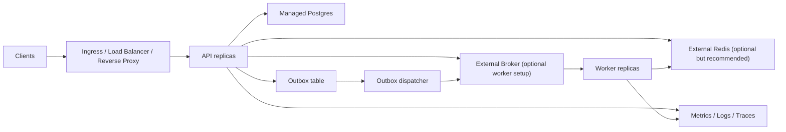

# Production Topology

This guide turns the template into a concrete production deployment shape.

Use it together with:

- [docs/deployment.md](/Users/pluto/Documents/git/fastapi101/docs/deployment.md)
- [docs/secret-management.md](/Users/pluto/Documents/git/fastapi101/docs/secret-management.md)
- [docs/observability.md](/Users/pluto/Documents/git/fastapi101/docs/observability.md)
- [docs/first-deploy-checklist.md](/Users/pluto/Documents/git/fastapi101/docs/first-deploy-checklist.md)

## Recommended Baseline

For a production-minded deployment, start from this topology:

## Component Recommendations

### API

Recommended:

- multiple stateless replicas
- readiness and liveness probes enabled
- no local disk assumptions for app state

### Postgres

Recommended:

- managed Postgres or a separately operated Postgres cluster
- automated backups
- point-in-time recovery when available
- connection pooling sized for API, worker, and maintenance jobs together

### Redis

Recommended when any of these are true:

- multiple API replicas need shared auth rate limiting
- multiple workers need shared idempotency state
- cache should survive per-process restarts

Recommended baseline role split:

- `/0` auth rate limiting and Redis health check
- `/1` worker idempotency
- `/2` application cache

Treat Redis as:

- optional for a single-instance starter
- recommended for production-like multi-instance use

### Broker

Use a durable external broker when worker flows are enabled.

Recommended:

- separate broker from API runtime
- durable queues
- retry and dead-letter queues configured
- monitoring for queue depth and connection failures

## Deployment Shapes By Maturity

### Small Internal Service

Acceptable shape:

- 1-2 API replicas
- managed Postgres
- external Redis optional
- worker optional

### Standard Multi-Instance Service

Recommended shape:

- 2+ API replicas
- managed Postgres
- external Redis
- worker and dispatcher separated
- internal Prometheus scrape or equivalent

### Async-Heavy Service

Recommended shape:

- API, worker, and dispatcher all scaled independently
- external broker
- external Redis
- DLQ monitoring and replay runbook
- outbox monitoring

## What Not To Co-Locate

Avoid treating these as part of the same lifecycle in production:

- API and Postgres
- API and Redis
- API and broker
- API and long-running background jobs

This keeps:

- deployments safer
- scaling cleaner
- failures more isolated

## Production Defaults To Prefer

Use these defaults unless you have a reason not to:

- Postgres outside the app deployment boundary
- Redis outside the app deployment boundary
- worker idempotency on Redis for multi-worker setups
- auth rate limiting on Redis for multi-instance API setups
- metrics scraped internally, not from the public internet
- one image, multiple commands for API, worker, dispatcher, and jobs
